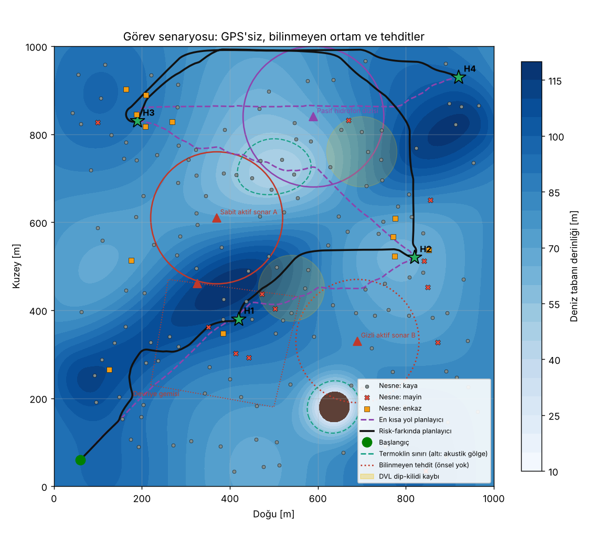
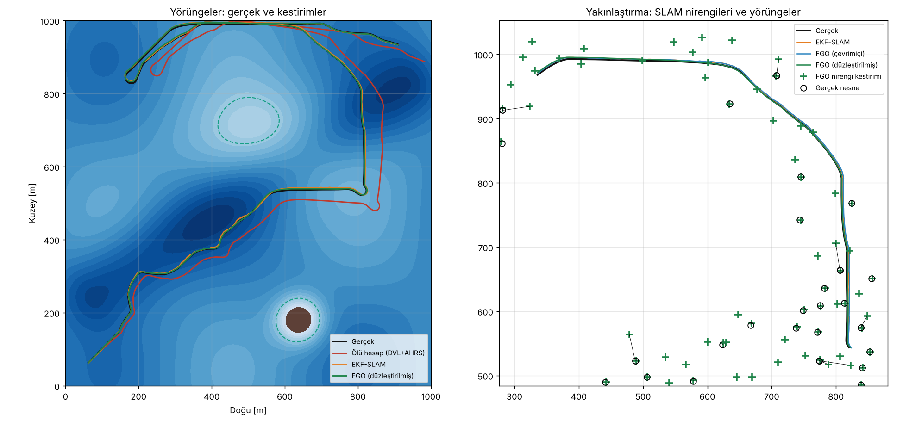
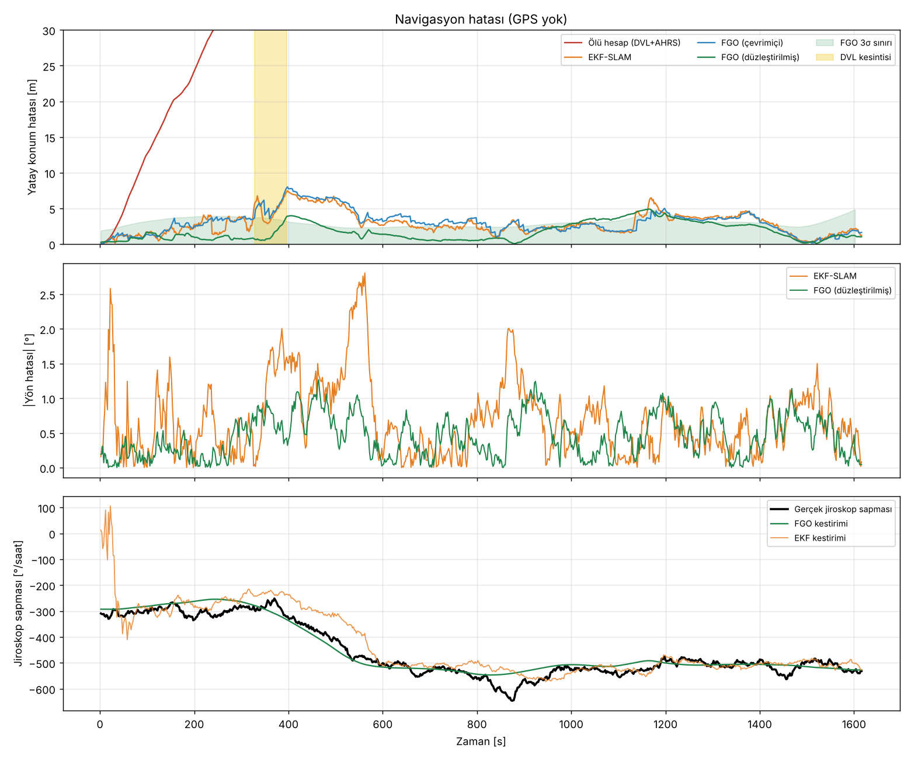
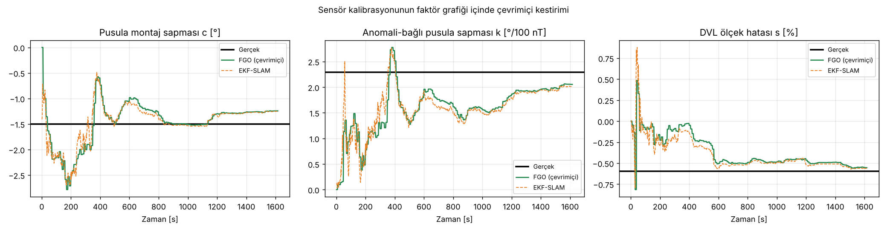
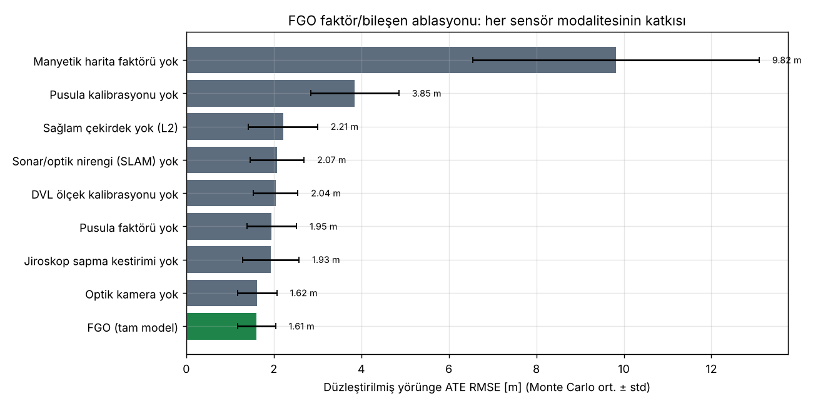
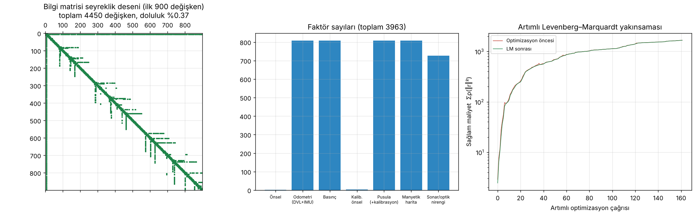
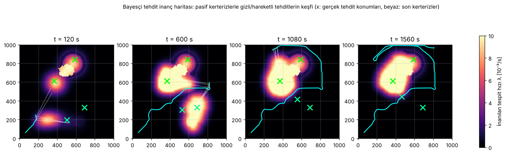
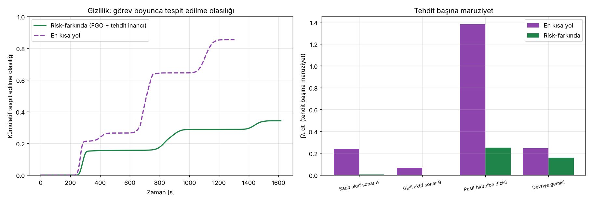
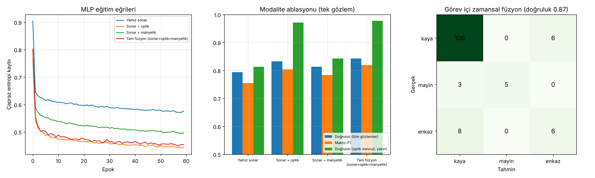
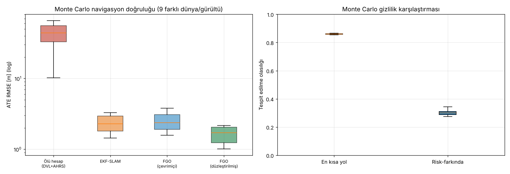

# Otonom Denizaltı Navigasyonu ve Keşfi İçin Çok Modlu Sensör Verisi Füzyonu
### Bilinmeyen, GPS'siz su altı ortamlarında Faktör Grafiği Optimizasyonu (FGO) ile sağlam navigasyon, gizlilik ve hedef tespiti

*Yapay Zekâ dersi — algoritma projesi (tamamen yazılımsal simülasyon)*

---

## Özet

Su altında GPS sinyali birkaç santimetrede sönümlenir; otonom su altı araçları (AUV) bu yüzden
ataletsel ölçümler ve hız sensörleri ile ölü hesap (dead reckoning) yapmak zorundadır ve hatası
zamanla sınırsız büyür. Bu projede akustik (ileri bakışlı sonar, pasif hidrofon), optik (kamera),
manyetik (pusula ve toplam alan şiddeti), basınç ve ataletsel (jiroskop) + Doppler hız kaydedici (DVL)
verilerini **Faktör Grafiği Optimizasyonu (FGO)** ile tek bir olasılıksal çıkarım probleminde
birleştiren bir yöntem geliştirdik. FGO; aracın yörüngesini, deniz tabanı nirengilerini (SLAM),
jiroskop sapmasını ve pusula montaj hatasını **ortak maksimum sonsal (MAP) kestirim** olarak çözer.
Navigasyon çekirdeğinin üzerine iki yapay zekâ bileşeni daha eklenmiştir: (i) sonar–optik–manyetik
öznitelikleri birleştiren, eksik modaliteye dayanıklı bir **çok katmanlı algılayıcı (MLP)** ile hedef
(mayın) sınıflandırma ve zamansal Bayes füzyonu; (ii) düşman sonar darbelerinin pasif kerterizlerinden
**Bayesçi tehdit inanç haritası** oluşturup tehdit maruziyetini en aza indiren **risk ve bilgi
farkında A\*** yol planlama. Sonuçlar `results/ozet.md` dosyasında ve aşağıda verilmiştir.

---

## 1. Problem tanımı

Araç, 1 km × 1 km'lik, haritası bilinmeyen bir deniz bölgesinde başlangıç noktasından dört
ara hedefe (keşif alanları H1–H3 ve çıkış H4) gitmelidir. Ortam:

| Bileşen | Modeli | Araç ne biliyor? |
|---|---|---|
| Batimetri | Analitik yüzey: sığ banka (termoklin üstü), deniz dağı (engel), derin kanal | 20 m çözünürlüklü, gürültülü kaba harita |
| Manyetik anomali | 30 jeolojik Gauss kaynağı + bölgesel gradyan + metalik nesnelerin imzaları | Eski bir hava/deniz araştırmasından 10 m çözünürlüklü harita (nesne imzaları **yok**) |
| Akıntılar | Zamanla dönen girdap + gelgit bileşeni (≈0.2 m/s) | Bilinmiyor |
| Bulanıklık | Mekâna bağlı optik görüş mesafesi (6–16 m) | Bilinmiyor |
| DVL kesinti bölgeleri | Dip kilidinin kaybolduğu iki dairesel bölge | Bilinmiyor |
| Deniz tabanı nesneleri | 150 kaya, 12 mayın, 12 enkaz (mayın/enkaz çoğunlukla keşif alanlarında) | Bilinmiyor |
| Tehditler | Sabit aktif sonar A (bilinen), **gizli** aktif sonar B, pasif hidrofon dizisi (bilinen), **hareketli devriye gemisi** (bilinmeyen) | Yalnızca istihbarat önseli (A ve hidrofon, konum belirsizliğiyle) |

Zorluklar: GPS yok, ortam bilinmiyor ve zamanla değişiyor (akıntı, devriye), sensörler bozuk
(jiroskop sapması, DVL ölçek hatası, pusula montaj hatası ve manyetik anomalilerin pusulayı
saptırması, sonar çoklu-yol yankıları ve yanlış alarmlar), tehdit konumlarının bir kısmı bilinmiyor.

## 2. Sensör modelleri

| Sensör | Ölçüm | Hata modeli |
|---|---|---|
| Jiroskop (IMU) | Yaw hızı, 2 Hz | Beyaz gürültü + rastgele yürüyüşlü sapma (≈5°/saat) |
| DVL | Gövde çerçevesinde yere göre hız | %0.6 modellenmemiş ölçek hatası; kesinti bölgelerinde pervane modeli (akıntıyı görmez) |
| Basınç | Derinlik | σ = 5 cm |
| Pusula | Yön | σ = 2°, ±1.5° montaj hatası, manyetik anomaliyle orantılı sapma (4·10⁻⁴ rad/nT) |
| Manyetometre | Toplam alan şiddeti anomalisi | σ = 2 nT; harita dışı mayın/enkaz imzaları (aykırı değer kaynağı) |
| İleri bakışlı sonar | Menzil–kerteriz–yükseliş, 80 m, ±65° | Menzile bağlı gürültü, %85 tespit, **%5 çoklu-yol hayalet yankısı**, yanlış alarmlar; ayrıca sınıflandırma öznitelikleri |
| Optik kamera | Görüş mesafesi içinde hassas göreli konum | σ ≈ 0.12 m·(1+ρ/10); renk/kenar/simetri öznitelikleri |
| Pasif hidrofon | Düşman aktif sonar darbelerinin kerterizi | σ = 4°, menzil ≈ 2.5 × tehdit yarıçapı |

## 3. Yöntem

### 3.1 Faktör Grafiği Optimizasyonu (FGO) — çekirdek algoritma

Faktör grafiği, bilinmeyen değişkenler (düğümler) ile ölçümlerin (faktörler) iki parçalı
grafıdır. Durum değişkenleri:

- Her 2 s'de bir **anahtar kare pozu**: $x_i = [p_x, p_y, z, \psi, b_g]$ (konum, derinlik, yön, jiroskop sapması)
- Her deniz tabanı nesnesi için **nirengi** $l_j \in \mathbb{R}^3$ (SLAM)
- Global **pusula kalibrasyon sapması** $c$ (sensör kalibrasyonu da çıkarımın parçasıdır)

MAP kestirimi, Gauss gürültü varsayımı altında doğrusal olmayan en küçük kareler problemine dönüşür:

$$X^\star = \arg\min_X \sum_k \rho_k\!\left(\left\| W_k\, r_k(X) \right\|^2\right), \qquad W_k^\top W_k = \Sigma_k^{-1}$$

Burada $r_k$ faktör artığı, $\Sigma_k$ ölçüm kovaryansı, $\rho_k$ sağlam (robust) çekirdektir.

**Faktörler:**

| Faktör | Artık $r$ | Bağlı değişkenler | Çekirdek |
|---|---|---|---|
| Önsel | $x_0 - \bar x_0$ | $x_0$ | — |
| Odometri (DVL+IMU ön-entegrasyon) | $\begin{bmatrix} R(\psi_i)^\top(p_j-p_i) - (\Delta p + J_p\,\delta b) \\ (z_j - z_i) - \Delta z \\ \psi_j - \psi_i - (\Delta\theta + J_\theta\,\delta b) \\ b_j - b_i \end{bmatrix}$ | $x_i, x_j$ | — |
| Basınç | $z_i - \tilde z$ | $x_i$ | — |
| Pusula (+kalibrasyon) | $\mathrm{wrap}(\psi_i + c - \tilde\psi)$ | $x_i, c$ | Huber |
| Manyetik harita eşleme | $M(p_x,p_y) - \tilde m$ | $x_i$ | Huber |
| Sonar / optik nirengi | $\begin{bmatrix} R(\psi_i)^\top(l_{xy}-p_{xy}) \\ l_z - z_i \end{bmatrix} - \tilde m$ | $x_i, l_j$ | Cauchy |

*Ön-entegrasyon (preintegration):* İki anahtar kare arasındaki tüm DVL ve jiroskop örnekleri
pozun yerel çerçevesinde tek bir göreli harekete ($\Delta p, \Delta z, \Delta\theta$) toplanır.
Jiroskop sapması değiştiğinde yeniden entegrasyon gerekmesin diye birinci dereceden Jacobian'lar
($J_p = \partial\Delta p/\partial b$, $J_\theta = -T$) ve gürültü kovaryansı adım adım yayılır
($\Sigma \leftarrow A\Sigma A^\top + Q$). DVL kesintisinde belirsizlik otomatik olarak büyür.

*Polar → Kartezyen sonar ölçümü:* Menzil–kerteriz–yükseliş ölçümü gövde çerçevesinde Kartezyen
vektöre çevrilir; kovaryansı $J\,\mathrm{diag}(\sigma_\rho^2,\sigma_\beta^2,\sigma_\varepsilon^2)\,J^\top$ ile yayılır.

*Sağlam çekirdekler (IRLS):* Beyazlatılmış artık normu $e$ için ağırlıklar
Huber: $w = \min(1, k/e)$, Cauchy: $w = 1/(1+(e/k)^2)$. Sonar çoklu-yol yankıları ve haritada
olmayan metalik nesnelerin manyetik imzaları gibi kaba hatalar bu sayede bastırılır.

*Çözücü:* Tüm faktör tipleri numpy ile **vektörize** değerlendirilir, seyrek Jacobian
(`scipy.sparse`) kurulur ve **Levenberg–Marquardt** adımı
$(J^\top J + \lambda\,\mathrm{diag}(J^\top J))\,\delta = -J^\top r$ seyrek LU (SuperLU) ile çözülür;
açı bileşenleri her adımda sarılır. Görev sırasında graf **artımlı** olarak büyür; her 5 anahtar
karede bir sıcak başlatmalı 3 LM iterasyonu yapılır (çevrimiçi kestirim, aracın güdümünde kullanılır),
görev sonunda tüm graf toplu olarak düzleştirilir (smoothing).

*Marjinal kovaryans:* Bilgi matrisi $H = J^\top J$'nin seyrek LU ayrıştırması ile ilgili blokların
tersi alınır; son pozun konum belirsizliği veri ilişkilendirme kapısında ve tehdit haritasında kullanılır.

### 3.2 Veri ilişkilendirme ön-ucu

Sonar/kamera gözlemleri FGO'nun tahmin edilen pozuyla dünya çerçevesine taşınır; poz
belirsizliğine göre genişleyen bir kapı ($7\,\mathrm{m} + 3\sigma_{xy} + 0.04\rho$) içinde en yakın nirengiye
açgözlü olarak eşlenir; kapı dışındakiler yeni nirengi başlatır. Gerçek nesne kimlikleri yalnızca
değerlendirme için kaydedilir.

### 3.3 Referans yöntemler

- **Ölü hesap (DVL + AHRS):** Endüstri standardı; jiroskop entegrasyonu + pusula tamamlayıcı filtresi.
- **EKF-SLAM:** FGO ile **aynı ölçüm modelleri**, aynı durum (sapmalar ve pusula kalibrasyonu dahil) ve aynı veri
  ilişkilendirmesi; aykırı değerler için χ² (%99.9) Mahalanobis kapısı. Böylece fark yalnızca kestirim
  algoritmasından kaynaklanır.

### 3.4 Çok modlu hedef sınıflandırma (YZ)

Her nesne gözlemi 11 boyutlu bir öznitelik vektörü üretir: sonar (hedef gücü, gölge düzenliliği,
boyut, parlak bölge düzenliliği), optik (renk kontrastı, kenar doğrusallığı, simetri — yalnızca
görüş mesafesi içinde), manyetik artık (yalnızca 12 m yakınında), iki modalite maskesi ve menzil.
Sınıflandırıcı numpy ile sıfırdan yazılmış bir **MLP**'dir (11→48→32→3, ReLU, softmax,
Adam, L2, sınıf ağırlıklı çapraz entropi). Eğitimde **modalite bırakma** (rastgele optik/manyetik
kanalları silme) uygulanır; böylece tek ağ eksik modalitelerle de çalışır (öznitelik düzeyinde erken
füzyon). Görev sırasında aynı nirengiye ait ardışık gözlemlerin olasılıkları **zamansal Bayes
füzyonu** ile birleştirilir ($\log P \mathrel{+}= \tau \log p_t$, $\tau = 0.5$ ile gözlemler arası
korelasyon için temkinli). "Doğrulanmış mayın" kararı: $P(\text{mayın}) > 0.6$ ve en az 2 gözlem.
Mayının konumu FGO'nun nirengi kestirimidir.

### 3.5 Bayesçi tehdit inanç haritası (gizlilik)

10 m'lik ızgarada iki katman tutulur:
1. **İstihbarat katmanı:** Bilinen tehditler için konum belirsizliğine göre Gauss olasılık lekeleri.
2. **Aktif yayıcı katmanı (log-odds):** Pasif hidrofonun yakaladığı her darbe kerterizi için hücre
   başına olabilirlik oranı $\log\frac{\mathcal N(\delta;0,\sigma_\text{eff})}{1/2\pi}$ hesaplanır
   ($\sigma_\text{eff}$ hidrofon gürültüsü, FGO'nun yön ve konum belirsizliğini içerir). Ortamda birden
   çok yayıcı olduğundan bir darbe diğer yönler için negatif kanıt sayılmaz: yalnızca pozitif kısım
   biriktirilir (Hough benzeri ışın oylaması). Farklı konumlardan alınan kerterizlerin kesiştiği
   hücreler hızla yükselir (nirengi ile yer tespiti); tekil ışınlar ve hareketli tehditlerin eski izleri
   **üstel unutma** (τ = 900 s) ile önsele döner → zamanla değişen tehditlere uyum.

Hücre başına inanılan tespit hızı, en kötü durum maks-konvolüsyonu ile hesaplanır:
$\hat\lambda(c) = \max_{c'} P(c')\,\lambda(\|c-c'\|, d(c), u(c))$. Tespit modeli
$\lambda = \lambda_\max \exp(-(r/R_\text{eff})^2)$; termoklin altında $R_\text{eff}$ %45 küçülür (akustik gölge),
pasif dinleyicilerde $R_\text{eff} \propto \sqrt{u}$ (hız arttıkça gürültü artar). Her hücrede metre başına
tehlikeyi ($\lambda/u$) en aza indiren hız seçilir: pasif dinleyiciye karşı yavaş ve sessiz,
aktif sonara karşı hızlı geçiş.

### 3.6 Risk ve bilgi farkında A* planlama

8-komşulu ızgarada kenar maliyeti:

$$c(a,b) = \|a-b\| \cdot \left(1 + w_\text{risk}\,\frac{\hat\lambda}{u} + w_\text{info}\,(1 - I)\right)$$

$I$, önsel manyetik haritanın gradyan büyüklüğünden türetilen *bilgi* haritasıdır (manyetik eşleme
için bilgilendirici bölgeler tercih edilir — aktif lokalizasyon). Sığ bölgeler engeldir. Öklid
sezgiseli kabul edilebilirdir (çarpan ≥ 1). Plan her 30 s'de ve her hedefe varışta güncel tehdit
inancı ile yeniden hesaplanır. Araç, planı **FGO'nun çevrimiçi poz kestirimi** ile takip eder (kapalı çevrim).

### 3.7 Sistem akışı (her anahtar karede)

```
IMU+DVL (2 Hz) ─► ön-entegrasyon ─┐
basınç, pusula, manyetometre ─────┼─► FGO (artımlı LM) ─► poz kestirimi ─► güdüm/kontrol
sonar + kamera ─► veri ilişkilendirme ─┘        │                  │
          └─► MLP sınıflandırıcı ─► zamansal Bayes füzyonu ─► doğrulanmış hedefler (FGO konumlu)
pasif hidrofon ─► kerteriz ─► Bayesçi tehdit haritası ─► risk haritası ─► A* (yeniden planlama)
```

## 4. Deney düzeni

- Ana görev (tohum 7) + Monte Carlo: her tohumda dünya (manyetik alan, nesneler, önsel haritalar)
  ve tüm sensör gürültüleri yeniden üretilir.
- Her dünyada iki görev: **risk-farkında** (önerilen) ve **en kısa yol** (tehdit bilgisini kullanmayan).
- **Ablasyon:** kaydedilen ölçümlerle FGO, faktör/modalite alt kümeleriyle yeniden çalıştırılır.
- **Zor koşullar:** %25 çoklu-yol, tarama başına 0.6 yanlış alarm, 2× pusula bozulması.
- Metrikler: ATE RMSE (mutlak yörünge hatası), son/maks. hata, yön RMSE, NEES (tutarlılık),
  nesne konum hatası, sınıflandırma doğruluğu/kesinlik/duyarlılık, kümülatif tespit edilme olasılığı
  $P_D = 1-\exp(-\int\lambda\,dt)$, maruziyet süresi, görev süresi.

## 5. Sonuçlar

Tüm sayılar 9 bağımsız denemenin (ana görev + 8 Monte Carlo tohumu; her tohumda farklı manyetik alan,
nesne yerleşimi, önsel harita hatası ve sensör gürültüsü) ortalama ± standart sapmasıdır.
Tam tablolar: [`results/ozet.md`](results/ozet.md), ham değerler: `results/metrics.json`.

### 5.1 Senaryo



### 5.2 Navigasyon doğruluğu (GPS yok, ~2.9 km görev)

| Yöntem | ATE RMSE [m] | Son hata [m] | Maks. hata [m] | Yön RMSE [°] |
|---|---|---|---|---|
| Ölü hesap (DVL+AHRS) | 41.69 ± 17.04 | 54.36 ± 27.59 | 59.39 ± 22.22 | 3.21 ± 1.41 |
| EKF-SLAM (aynı modeller) | 2.33 ± 0.65 | 1.34 ± 0.67 | 6.38 ± 1.32 | 0.75 ± 0.07 |
| FGO (çevrimiçi) | 2.55 ± 0.71 | 1.59 ± 0.81 | 6.93 ± 1.28 | 0.81 ± 0.08 |
| **FGO (düzleştirilmiş)** | **1.61 ± 0.43** | 1.56 ± 0.77 | **3.88 ± 1.05** | **0.43 ± 0.07** |




FGO ile düzleştirilmiş yörünge, ölü hesaba göre **~26 kat**, EKF-SLAM'e göre **%31** daha düşük
ATE verir; maksimum hata %39 azalır. Jiroskop sapması (≈ −300…−100 °/saat arasında rastgele yürüyen)
FGO tarafından düzgünce izlenir (Şekil 3, alt).

### 5.3 Sensör kalibrasyonu grafın içinde



| Parametre | Gerçek | FGO kestirimi (ana görev) |
|---|---|---|
| Pusula montaj sapması c | −1.50° | −1.25° |
| Anomaliye bağlı pusula sapma katsayısı k | 0.0400 rad/100 nT | 0.0358 rad/100 nT |
| DVL ölçek hatası s | −0.596 % | −0.554 % |

Kalibrasyon değişkenleri sayesinde FGO'nun tutarlılığı da iyileşti: Monte Carlo ortalama
NEES **4.56 ± 1.75** (ideal 2; kalibrasyon değişkenleri eklenmeden önce ≈ 21 idi).

### 5.4 Ablasyon: hangi modalite ne katıyor?



| Yapılandırma | ATE RMSE [m] |
|---|---|
| **FGO (tam model)** | **1.61 ± 0.43** |
| Optik kamera yok | 1.62 ± 0.45 |
| Jiroskop sapma kestirimi yok | 1.93 ± 0.64 |
| Pusula faktörü yok | 1.95 ± 0.57 |
| DVL ölçek kalibrasyonu yok | 2.04 ± 0.51 |
| Sonar/optik nirengi (SLAM) yok | 2.07 ± 0.62 |
| Sağlam çekirdek yok (L2) | 2.21 ± 0.79 |
| Pusula kalibrasyonu yok | 3.85 ± 1.00 |
| Manyetik harita faktörü yok | 9.82 ± 3.27 |

### 5.5 Aykırı değerlere dayanıklılık (zor koşullar)

%25 sonar çoklu-yol hayalet yankısı, tarama başına 0.6 yanlış alarm, 2× pusula bozulması:

| Yöntem | ATE RMSE [m] |
|---|---|
| Ölü hesap | 29.41 ± 20.11 |
| EKF-SLAM (χ² kapısı) | 2.53 ± 0.55 |
| FGO, sağlam çekirdek yok | 4.88 ± 2.71 |
| **FGO (Huber + Cauchy)** | **2.22 ± 0.78** |

### 5.6 Faktör grafiğinin yapısı



Ana görevde graf 809 poz, 134 nirengi ve 3 kalibrasyon değişkeni (toplam 4450 skaler değişken) ile
3963 faktör içerir; bilgi matrisinin doluluğu yalnızca **%0.37**'dir. Bu seyreklik sayesinde
görevin tamamının toplu düzleştirilmesi **0.41 s** sürer (tek çekirdek, saf Python/numpy/scipy).
(Sağdaki maliyet eğrisi graf büyüdükçe artar çünkü her çağrıda yeni faktörler eklenir; her çağrıda
LM maliyeti düşürür.)

### 5.7 Gizlilik: tehdit maruziyetinin en aza indirilmesi




| Planlayıcı | Tespit edilme olasılığı | Maruziyet süresi [s] | Görev süresi [s] | Yol [m] |
|---|---|---|---|---|
| En kısa yol | 0.86 ± 0.00 | 330.9 ± 5.2 | 1315 ± 9 | 2423 ± 13 |
| **Risk-farkında (önerilen)** | **0.30 ± 0.02** | **55.3 ± 15.2** | 1638 ± 26 | 2945 ± 41 |

Risk-farkında planlayıcı tespit edilme olasılığını **%65**, tehdit menzilinde geçen süreyi
**%83** azaltır; bedeli %25 daha uzun görev süresidir. Gizli aktif sonar B ve hareketli devriye
gemisi önceden bilinmemesine rağmen, pasif kerterizlerle birkaç dakika içinde inanç haritasında
belirir ve rota onların etrafından yeniden planlanır (Şekil 6). Araç uzaklaştıkça eski inanç unutulur.

### 5.8 Hedef tespiti ve sınıflandırma



| Model (tek gözlem) | Doğruluk | Makro-F1 | Mayın duyarlılığı | Doğruluk (optik mevcutken) |
|---|---|---|---|---|
| Yalnız sonar | 0.794 | 0.756 | 0.896 | 0.813 |
| Sonar + optik | 0.833 | 0.804 | 0.924 | 0.971 |
| Sonar + manyetik | 0.813 | 0.783 | 0.891 | 0.843 |
| **Tam füzyon** | **0.843** | **0.819** | **0.929** | **0.978** |

Görev içinde (zamansal Bayes füzyonu ile):
- Nesne sınıflandırma doğruluğu **0.92 ± 0.02**,
- Doğrulanmış mayın raporlarının kesinliği **0.97 ± 0.06**, görülen mayınlar içinde duyarlılık **0.81 ± 0.20**
  (rota 12 mayından ortalama 6.3'ünün sensör menziline girer),
- Tespit edilen mayınların konum hatası (FGO nirengisi) **2.25 ± 1.39 m**; ölü hesap pozlarıyla
  yapılan konumlandırmada nesne hatası **≈ 36 m**'dir.

### 5.9 Monte Carlo dağılımları




## 6. Tartışma

**FGO neden daha iyi?** EKF her ölçümü bir kez, o anki doğrusallaştırma noktasında işler ve geçmiş
pozları unutur. FGO ise tüm geçmişi değişken olarak tutar ve her optimizasyonda **yeniden
doğrusallaştırır**; nirengiyi tekrar görmek (döngü kapama) veya kalibrasyon kestiriminin iyileşmesi
geçmiş yörüngeyi de düzeltir. Bu nedenle *düzleştirilmiş* FGO açık farkla en iyisidir.
Çevrimiçi (filtreleme) modunda ise FGO ile EKF benzerdir (2.55 m vs 2.33 m): aynı ölçüm modelleri ve
aynı bilgi kullanıldığında son pozun kestirimi iki yöntemde teorik olarak yakındır; ek LM iterasyonu
ya da her karede optimizasyon bu farkı kapatmadı (deneylerde denendi). Küçük fark, EKF'nin χ² kapısıyla
harita dışı manyetik imzaları tamamen reddetmesi, FGO'nun ise Huber/Cauchy ile yalnızca ağırlıklarını
azaltmasından kaynaklanıyor olabilir. Bunu gizlemiyoruz: FGO'nun asıl kazancı düzleştirme,
haritalama, aykırı değer dayanıklılığı ve tutarlılıktır.

**Ablasyondan çıkan dersler.**
- *Manyetik harita eşleme* GPS'siz ortamda tek **mutlak** konum kaynağıdır; çıkarılınca hata 6 kat
  artar. SLAM nirengileri yalnızca göreli bilgi verir, mutlak sürüklenmeyi tek başına durduramaz.
- *Sensör kalibrasyonu* kritik: pusula hatası manyetik anomaliyle ilişkili (renkli, zamanla
  bağıntılı) olduğundan beyaz gürültü varsaymak FGO'yu yanıltır. İlk denemelerimizde pusulayı
  çıkarmak FGO'yu iyileştiriyordu; pusula sapmasını önsel manyetik haritaya bağlı modelleyip katsayısını
  grafın içinde kestirdiğimizde pusula yeniden faydalı hale geldi (bkz. ablasyon "pusula kalibrasyonu yok": 3.85 m).
- *Optik kamera* navigasyona neredeyse katkı vermez (görüş 6–16 m, nadiren nesne görür) ama
  hedef sınıflandırmada belirleyicidir (optik mevcutken doğruluk 0.81 → 0.98).
- *Sağlam çekirdekler* normal koşullarda küçük, zor koşullarda büyük fark yaratır
  (4.88 → 2.22 m). Robust kernel olmayan FGO, hayalet yankılar yüzünden EKF'nin bile gerisinde kalır.

**Gizlilik – süre ödünleşimi.** $w_\text{risk}$ ağırlığı tespit olasılığı ile görev süresi arasında
ayarlanabilir bir ödünleşim sunar. Aktif sonara karşı yavaşlamanın zararlı olduğu ilk denemelerde
görüldü (daha uzun maruziyet); bu yüzden hız, hücre başına $\lambda/u$'yu en aza indirecek şekilde
seçilir. Tehdit inanç haritasında ilk sürümde kullandığımız "tam Bayes" negatif kanıt güncellemesinin
çok-yayıcılı ortamda yanlış olduğu (bir sonarın darbesi diğerinin hücresini bastırıyordu) bulundu ve
yalnız pozitif kanıt + unutma ile düzeltildi.

**Sınırlamalar.**
- Tüm veriler simülasyondur; gerçek sonar görüntüsünden öznitelik çıkarımı yerine sentetik öznitelikler
  kullanıldı (CNN tabanlı görüntü sınıflandırma doğal bir sonraki adım).
- 4-SD (x, y, z, yaw) poz modeli; yuvarlanma/yunuslama ihmal edildi.
- Hayalet yankılardan doğan tek gözlemli sahte nirengiler "tüm nirengiler" RMSE'sini şişiriyor
  (15 m); doğrulanmış nirengilerde 2.8 m. İz doğrulama (track confirmation) eklenebilir.
- NEES ≈ 4.6 (> 2): manyetik harita hatası gibi zamanla bağıntılı hatalar hâlâ hafif aşırı özgüvene yol açıyor.
- Çevrimiçi FGO tüm grafı yeniden çözer; çok uzun görevlerde iSAM2 benzeri artımlı çözüm veya
  sabit gecikmeli (fixed-lag) marjinalleştirme gerekir.


## 7. Sonuç

Bu projede bilinmeyen, zamanla değişen ve GPS'siz su altı ortamında çalışan bir AUV için;
akustik, optik, manyetik, basınç ve ataletsel verileri **Faktör Grafiği Optimizasyonu** ile birleştiren,
üstüne YZ tabanlı hedef sınıflandırma ve gizlilik odaklı planlama ekleyen uçtan uca bir sistem
sıfırdan geliştirildi. Monte Carlo deneylerinde FGO:

- konum hatasını ölü hesaba göre **41.7 m → 1.6 m**'ye indirdi ve EKF-SLAM'den %31 daha doğru oldu,
- jiroskop sapması, pusula montaj ve anomali sapması ile DVL ölçek hatasını **çevrimiçi kalibre** etti,
- yoğun aykırı ölçümler altında sağlam çekirdeklerle doğruluğunu korudu,
- mayınları **~2 m** doğrulukla konumlandırmayı mümkün kıldı (sınıflandırma kesinliği 0.97);

risk-farkında planlayıcı ise önceden bilinmeyen tehditleri pasif dinlemeyle keşfedip tespit edilme
olasılığını **0.86'dan 0.30'a** düşürdü.


## Kaynaklar

1. F. Dellaert, M. Kaess, "Factor Graphs for Robot Perception", *Foundations and Trends in Robotics*, 2017.
2. M. Kaess vd., "iSAM2: Incremental Smoothing and Mapping Using the Bayes Tree", *IJRR*, 2012.
3. C. Forster vd., "On-Manifold Preintegration for Real-Time Visual-Inertial Odometry", *IEEE T-RO*, 2017.
4. L. Paull, S. Saeedi, M. Seto, H. Li, "AUV Navigation and Localization: A Review", *IEEE J. Oceanic Eng.*, 2014.
5. J. Melo, A. Matos, "Survey on advances on terrain based navigation for autonomous underwater vehicles", *Ocean Engineering*, 2017.
6. P. Agarwal vd., "Robust Map Optimization Using Dynamic Covariance Scaling", *ICRA*, 2013.
7. S. Thrun, W. Burgard, D. Fox, *Probabilistic Robotics*, MIT Press, 2005 (occupancy grid, EKF-SLAM).
8. P. Hart, N. Nilsson, B. Raphael, "A Formal Basis for the Heuristic Determination of Minimum Cost Paths", *IEEE TSSC*, 1968.
9. D. P. Kingma, J. Ba, "Adam: A Method for Stochastic Optimization", *ICLR*, 2015.
10. N. Neverova vd., "ModDrop: Adaptive Multi-modal Gesture Recognition", *IEEE TPAMI*, 2016 (modalite bırakma).
