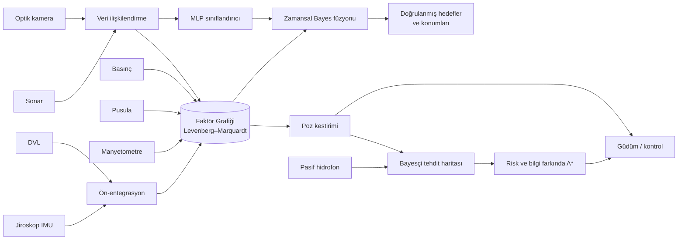

<div align="center">

# 🌊 Otonom Denizaltı (AUV) Navigasyonu ve Keşfi İçin Çok Modlu Sensör Verisi Füzyonu

### Bilinmeyen, GPS'siz su altı ortamlarında **Faktör Grafiği Optimizasyonu (FGO)** ile sağlam navigasyon, gizlilik ve hedef tespiti


-lightgrey)


*Şekil 1 — GPS'siz, bilinmeyen ortamda görev senaryosu: batimetri, termoklin, tehditler, deniz tabanı nesneleri; risk-farkında rota (siyah) ve en kısa rota (mor kesikli).*

</div>

---

## 📑 İçindekiler

1. [Proje Özeti](#-proje-özeti)
2. [Öne Çıkan Sonuçlar](#-öne-çıkan-sonuçlar)
3. [Problem Tanımı](#-problem-tanımı)
4. [Sistem Mimarisi](#️-sistem-mimarisi)
5. [Sensör Modelleri](#-sensör-modelleri)
6. [Yöntem](#-yöntem)
7. [Deneyler ve Sonuçlar](#-deneyler-ve-sonuçlar)
8. [Kurulum ve Çalıştırma](#-kurulum-ve-çalıştırma)
9. [Proje Yapısı](#-proje-yapısı)
10. [Önemli Parametreler](#️-önemli-parametreler)
11. [Sınırlamalar ve Gelecek Çalışmalar](#️-sınırlamalar-ve-gelecek-çalışmalar)
12. [Kaynaklar](#-kaynaklar)

---

## 🎯 Proje Özeti

Su altında GPS sinyali birkaç santimetrede sönümlenir. Otonom su altı araçları (AUV) bu yüzden
ataletsel sensörler ve hız ölçerlerle **ölü hesap** (dead reckoning) yapar ve hata zamanla
sınırsız büyür. Bu projede:

| Hedef | Kullanılan yapay zekâ / algoritma |
|---|---|
| 🧭 **Sağlam navigasyon** | **Faktör Grafiği Optimizasyonu (FGO)** — SLAM + manyetik harita eşleme + çevrimiçi sensör kalibrasyonu |
| 🎯 **Hedef tespiti** | Çok modlu **MLP sinir ağı** (sonar + optik + manyetik) + zamansal Bayes füzyonu |
| 🥷 **Gizlilik** | **Bayesçi tehdit inanç haritası** (pasif kerteriz oylaması) + **risk/bilgi farkında A\*** |

Akustik, optik, manyetik, basınç ve ataletsel sensör verileri tek bir olasılıksal çıkarım
probleminde birleştirilir. Her şey — FGO çözücüsü, sinir ağı, planlayıcı — **numpy/scipy ile sıfırdan**
yazılmıştır; GTSAM, g2o, PyTorch gibi hazır kütüphane kullanılmamıştır. Proje **tamamen yazılımsaldır**,
donanım gerektirmez.

> 📄 Ayrıntılı akademik rapor: **[RAPOR.md](RAPOR.md)** · 📊 Otomatik sonuç özeti: **[results/ozet.md](results/ozet.md)** · 🗃️ Ham metrikler: `results/metrics.json`

---

## 🏆 Öne Çıkan Sonuçlar

*9 bağımsız deneme (ana görev + 8 Monte Carlo tohumu) ortalaması, ~2.9 km'lik GPS'siz görev.*

<div align="center">

| Metrik | Ölü hesap | EKF-SLAM | **FGO (bu çalışma)** |
|:---|:---:|:---:|:---:|
| Konum hatası (ATE RMSE) | 41.69 m | 2.33 m | **1.61 m** ✅ |
| Maksimum konum hatası | 59.39 m | 6.38 m | **3.88 m** ✅ |
| Yön hatası (RMSE) | 3.21° | 0.75° | **0.43°** ✅ |
| Zor koşullarda ATE | 29.41 m | 2.53 m | **2.22 m** ✅ |

| Gizlilik | En kısa yol | **Risk-farkında (önerilen)** | Değişim |
|:---|:---:|:---:|:---:|
| Tespit edilme olasılığı | 0.86 | **0.30** | **%65 ↓** |
| Tehdit menzilinde geçen süre | 331 s | **55 s** | **%83 ↓** |
| Görev süresi | 1315 s | 1638 s | %25 ↑ (bedel) |

| Hedef tespiti | Değer |
|:---|:---:|
| Görev içi nesne sınıflandırma doğruluğu | **0.92** |
| Doğrulanmış mayın raporu kesinliği | **0.97** |
| Mayın konumlandırma hatası (FGO) | **2.25 m** (ölü hesapla ≈ 36 m) |

</div>

- 📉 FGO, ölü hesaba göre **~26 kat**, EKF-SLAM'e göre **%31** daha doğru yörünge kestirir.
- 🔧 Pusula montaj sapması, anomaliye bağlı pusula sapması ve DVL ölçek hatası **grafın içinde çevrimiçi kalibre edilir**.
- 🛡️ Huber/Cauchy sağlam çekirdekleri sayesinde sonar hayalet yankılarına ve harita dışı manyetik imzalara dayanıklıdır.

---

## 🌍 Problem Tanımı

Araç, **1 km × 1 km**'lik, haritası bilinmeyen bir deniz bölgesinde başlangıçtan üç keşif alanına
(H1–H3) ve çıkışa (H4) gitmelidir.

| Bileşen | Gerçek dünya modeli | Aracın bildiği |
|---|---|---|
| 🏔️ Batimetri | Sığ banka (termoklin üstü), deniz dağı (engel), derin kanal | Kaba, gürültülü harita (20 m) |
| 🧲 Manyetik anomali | 30 jeolojik kaynak + gradyan + metal nesne imzaları | Eski araştırma haritası (10 m), nesne imzaları **yok** |
| 🌊 Akıntılar | Zamanla dönen girdap + gelgit (~0.2 m/s) | ❌ Bilinmiyor |
| 🌫️ Bulanıklık | Konuma bağlı optik görüş (6–16 m) | ❌ Bilinmiyor |
| 📡 DVL kesintisi | Dip kilidinin kaybolduğu iki bölge | ❌ Bilinmiyor |
| 🪨 Deniz tabanı nesneleri | 150 kaya, 12 mayın, 12 enkaz | ❌ Bilinmiyor |
| ⚠️ Tehditler | Sabit sonar A, **gizli** sonar B, pasif hidrofon dizisi, **hareketli devriye gemisi** | Yalnızca A ve hidrofon (belirsiz konumla) |

**Zorluklar:** GPS yok · ortam bilinmiyor ve zamanla değişiyor · jiroskop sapması · DVL ölçek hatası ·
pusulayı saptıran manyetik anomaliler · sonar çoklu-yol yankıları ve yanlış alarmlar · tehditlerin bir kısmı bilinmiyor.

---

## 🏗️ Sistem Mimarisi



Her **2 saniyede bir** (anahtar kare): odometri ön-entegre edilir → ölçümler alınır → sonar/kamera
gözlemleri nirengilere eşlenir → FGO güncellenir → hedefler sınıflandırılır → tehdit inancı güncellenir →
gerekirse rota yeniden planlanır. Araç, **FGO'nun kestirimiyle** güdülür (kapalı çevrim).

---

## 📡 Sensör Modelleri

| Sensör | Ölçüm | Hata modeli |
|---|---|---|
| 🌀 Jiroskop (IMU) | Yaw hızı (2 Hz) | Beyaz gürültü + rastgele yürüyüşlü sapma |
| 🔊 DVL | Gövde çerçevesinde yere göre hız | %0.6 ölçek hatası; kesintide pervane modeli (akıntıyı görmez) |
| 📏 Basınç | Derinlik | σ = 5 cm |
| 🧭 Pusula | Yön | σ = 2°, ±1.5° montaj hatası, manyetik anomaliyle orantılı sapma |
| 🧲 Manyetometre | Toplam alan anomalisi | σ = 2 nT; haritada olmayan mayın/enkaz imzaları |
| 📶 Sonar | Menzil–kerteriz–yükseliş (80 m, ±65°) | %85 tespit, **%5 hayalet yankı**, yanlış alarmlar |
| 📷 Optik kamera | Görüş mesafesinde hassas göreli konum | σ ≈ 0.12 m·(1+ρ/10) |
| 👂 Pasif hidrofon | Düşman sonar darbelerinin kerterizi | σ = 4° |

---

## 🧠 Yöntem

### 1. Faktör Grafiği Optimizasyonu (FGO) — çekirdek algoritma

Faktör grafiği; **bilinmeyen değişkenleri** (düğümler) ve onları bağlayan **ölçümleri** (faktörler)
içeren iki parçalı bir graftır. Durum değişkenleri:

| Değişken | Boyut | Açıklama |
|---|:---:|---|
| Poz $x_i = [p_x, p_y, z, \psi, b_g]$ | 5 | Konum, derinlik, yön, jiroskop sapması (her 2 s) |
| Nirengi $l_j$ | 3 | Deniz tabanı nesnesi konumu (SLAM) |
| Pusula kalibrasyonu $[c, k]$ | 2 | Montaj sapması + anomaliye bağlı sapma katsayısı |
| DVL ölçek hatası $s$ | 1 | Hız ölçeği kalibrasyonu |

Maksimum sonsal (MAP) kestirim, doğrusal olmayan en küçük kareler problemine dönüşür:

$$X^\star = \arg\min_X \sum_k \rho_k\left(\left\| W_k\, r_k(X) \right\|^2\right), \qquad W_k^\top W_k = \Sigma_k^{-1}$$

| Faktör | Bağladığı değişkenler | Sağlam çekirdek |
|---|---|:---:|
| Önsel | İlk poz | — |
| **Odometri** (DVL + IMU ön-entegrasyon, DVL ölçek dahil) | $x_i, x_j, s$ | — |
| Basınç | $x_i$ | — |
| **Pusula + kalibrasyon** $\psi_i + c + k\,M(x,y) - \tilde\psi$ | $x_i, [c,k]$ | Huber |
| **Manyetik harita eşleme** $M(p_x,p_y) - \tilde m$ | $x_i$ | Huber |
| **Sonar / optik nirengi** (SLAM) | $x_i, l_j$ | Cauchy |

**Teknik ayrıntılar:**
- ⚡ **Ön-entegrasyon:** İki anahtar kare arasındaki tüm DVL/jiroskop örnekleri tek bir göreli harekete toplanır; sapmaya göre Jacobian'lar ve kovaryans yayılır.
- 🛡️ **Sağlam çekirdekler (IRLS):** Huber $w=\min(1,k/e)$, Cauchy $w=1/(1+(e/k)^2)$.
- 🧮 **Çözücü:** Vektörize faktör değerlendirme → seyrek Jacobian → **Levenberg–Marquardt**, SuperLU ile.
- 🔁 **Artımlı çalışma:** Görev boyunca 5 karede bir 3 LM iterasyonu (çevrimiçi), görev sonunda tüm graf düzleştirilir.
- 📐 **Marjinal kovaryans:** Bilgi matrisinin seyrek LU'su ile; veri ilişkilendirme kapısında ve tehdit haritasında kullanılır.

<div align="center">


*Şekil 2 — Bilgi matrisinin seyreklik deseni (doluluk %0.37), faktör sayıları ve artımlı LM maliyeti.*
</div>

### 2. Veri İlişkilendirme Ön-ucu

Sonar/kamera gözlemleri tahmini pozla dünya çerçevesine taşınır, en yakın nirengiye
$7\,\text{m} + 3\sigma_{xy} + 0.04\rho$ genişliğinde bir kapı içinde açgözlü olarak eşlenir; kapı dışındakiler yeni nirengi başlatır.

### 3. Çok Modlu Hedef Sınıflandırma (MLP)

| Modalite | Öznitelikler | Ne zaman mevcut? |
|---|---|---|
| 🔊 Sonar | Hedef gücü, gölge düzenliliği, boyut, parlak bölge düzenliliği | Her zaman |
| 📷 Optik | Renk kontrastı, kenar doğrusallığı, simetri | Görüş mesafesi içinde |
| 🧲 Manyetik | Haritaya göre artık alan | 12 m yakınında |
| ➕ Diğer | 2 modalite maskesi + menzil | — |

- **Ağ:** 11 → 48 → 32 → 3 (ReLU, softmax), Adam, L2, sınıf ağırlıklı çapraz entropi — numpy ile sıfırdan.
- **Modalite bırakma:** Eğitimde optik/manyetik kanallar rastgele silinir → tek ağ eksik veriyle de çalışır.
- **Zamansal Bayes füzyonu:** Aynı nesnenin gözlemleri $\log P \mathrel{+}= 0.5\,\log p_t$ ile birleştirilir.
- **Doğrulanmış mayın kuralı:** $P(\text{mayın}) > 0.6$ ve en az 2 gözlem. Mayın konumu = FGO nirengi kestirimi.

### 4. Bayesçi Tehdit İnanç Haritası

| Katman | İçerik |
|---|---|
| İstihbarat katmanı | Bilinen tehditler için konum belirsizliğine göre Gauss lekeleri |
| Aktif yayıcı katmanı (log-odds) | Pasif kerterizlerin pozitif olabilirlik oranları birikir (Hough benzeri ışın oylaması); kesişimler yayıcıyı ortaya çıkarır, **üstel unutma** (τ = 900 s) hareketli tehditlere uyum sağlar |

Tespit modeli $\lambda = \lambda_{\max} e^{-(r/R_{\text{eff}})^2}$: **termoklin altında** $R_{\text{eff}}$ %45 küçülür (akustik gölge),
pasif dinleyicilerde $R_{\text{eff}} \propto \sqrt{u}$. Her hücrede metre başına tehlikeyi ($\lambda/u$) en aza indiren
hız seçilir: pasif dinleyiciye karşı **yavaş ve sessiz**, aktif sonara karşı **hızlı geçiş**.

<div align="center">


*Şekil 3 — Tehdit inanç haritasının evrimi: gizli sonar B ve devriye gemisi pasif kerterizlerle (beyaz çizgiler) keşfedilir.*
</div>

### 5. Risk ve Bilgi Farkında A* Planlama

$$c(a,b) = \|a-b\| \cdot \left(1 + w_{\text{risk}}\,\frac{\hat\lambda}{u} + w_{\text{info}}\,(1 - I)\right)$$

- $\hat\lambda/u$: metre başına beklenen tespit tehlikesi (gizlilik)
- $I$: manyetik haritanın gradyanından türetilen **bilgi** haritası (aktif lokalizasyon — navigasyon için bilgilendirici bölgeler tercih edilir)
- Sığ bölgeler engeldir; plan her 30 s'de ve hedefe varışta yeniden hesaplanır.

---

## 📊 Deneyler ve Sonuçlar

**Deney düzeni:** Ana görev + 8 Monte Carlo tohumu (her birinde farklı manyetik alan, nesne yerleşimi,
önsel harita hatası ve sensör gürültüsü). Her dünyada **risk-farkında** ve **en kısa yol** görevleri koşulur.

### 🧭 Navigasyon doğruluğu

| Yöntem | ATE RMSE [m] | Son hata [m] | Maks. hata [m] | Yön RMSE [°] |
|---|---|---|---|---|
| Ölü hesap (DVL+AHRS) | 41.69 ± 17.04 | 54.36 ± 27.59 | 59.39 ± 22.22 | 3.21 ± 1.41 |
| EKF-SLAM (aynı modeller) | 2.33 ± 0.65 | 1.34 ± 0.67 | 6.38 ± 1.32 | 0.75 ± 0.07 |
| FGO (çevrimiçi) | 2.55 ± 0.71 | 1.59 ± 0.81 | 6.93 ± 1.28 | 0.81 ± 0.08 |
| **FGO (düzleştirilmiş)** | **1.61 ± 0.43** | 1.56 ± 0.77 | **3.88 ± 1.05** | **0.43 ± 0.07** |

<div align="center">


*Şekil 4 — Gerçek ve kestirilen yörüngeler; sağda SLAM nirengilerinin yakınlaştırılmış görünümü.*


*Şekil 5 — Konum hatası (FGO 3σ sınırıyla), yön hatası ve jiroskop sapması kestirimi.*
</div>

> ℹ️ **Not:** Çevrimiçi (filtreleme) modda FGO ile EKF benzer başarımdadır (2.55 vs 2.33 m).
> FGO'nun asıl kazancı **düzleştirme**, **haritalama**, **aykırı değer dayanıklılığı** ve **tutarlılıktadır**.

### 🔧 Çevrimiçi sensör kalibrasyonu

| Parametre | Gerçek | FGO kestirimi |
|---|:---:|:---:|
| Pusula montaj sapması $c$ | −1.50° | −1.25° |
| Anomaliye bağlı pusula sapması $k$ | 0.0400 rad/100 nT | 0.0358 rad/100 nT |
| DVL ölçek hatası $s$ | −0.596 % | −0.554 % |

<div align="center">


*Şekil 6 — Kalibrasyon değişkenlerinin görev boyunca yakınsaması.*
</div>

Kalibrasyon değişkenleri FGO'nun tutarlılığını da iyileştirir: ortalama NEES **4.56 ± 1.75** (ideal 2; kalibrasyon eklenmeden önce ≈ 21).

### 🧪 Ablasyon: her bileşenin katkısı

| Yapılandırma | ATE RMSE [m] | Etki |
|---|---|:---:|
| **FGO (tam model)** | **1.61 ± 0.43** | — |
| Optik kamera yok | 1.62 ± 0.45 | ≈ |
| Jiroskop sapma kestirimi yok | 1.93 ± 0.64 | 🔺 |
| Pusula faktörü yok | 1.95 ± 0.57 | 🔺 |
| DVL ölçek kalibrasyonu yok | 2.04 ± 0.51 | 🔺 |
| Sonar/optik nirengi (SLAM) yok | 2.07 ± 0.62 | 🔺 |
| Sağlam çekirdek yok (L2) | 2.21 ± 0.79 | 🔺 |
| Pusula kalibrasyonu yok | 3.85 ± 1.00 | 🔺🔺 |
| Manyetik harita faktörü yok | 9.82 ± 3.27 | 🔺🔺🔺 |

<div align="center">

</div>

- **Manyetik harita eşleme**, GPS'siz ortamda tek mutlak konum kaynağıdır; çıkarılınca hata 6 kat artar.
- **Optik kamera** navigasyona neredeyse katkı vermez ama hedef sınıflandırmada belirleyicidir (optik varken doğruluk 0.81 → 0.98).

### 🛡️ Zor koşullar (%25 hayalet yankı, 0.6 yanlış alarm/tarama, 2× pusula bozulması)

| Yöntem | ATE RMSE [m] |
|---|---|
| Ölü hesap | 29.41 ± 20.11 |
| EKF-SLAM (χ² kapısı) | 2.53 ± 0.55 |
| FGO, sağlam çekirdek yok | 4.88 ± 2.71 |
| **FGO (Huber + Cauchy)** | **2.22 ± 0.78** |

### 🗺️ Haritalama (nesne konum hatası)

| Kaynak | RMSE, doğrulanmış (≥3 gözlem) | Medyan | RMSE, tüm nirengiler |
|---|---|---|---|
| **FGO** | **2.81 ± 1.23 m** | 1.43 m | 15.21 m* |
| EKF-SLAM | 3.62 ± 1.13 m | 1.29 m | 15.31 m* |
| Ölü hesap | 36.41 ± 12.55 m | 36.25 m | 40.64 m |

<sub>* Tek gözlemli hayalet yankı nirengileri dahil.</sub>

### 🥷 Gizlilik

| Planlayıcı | Tespit olasılığı | Maruziyet [s] | Görev süresi [s] | Yol [m] |
|---|---|---|---|---|
| En kısa yol | 0.86 ± 0.00 | 330.9 ± 5.2 | 1315 ± 9 | 2423 ± 13 |
| **Risk-farkında** | **0.30 ± 0.02** | **55.3 ± 15.2** | 1638 ± 26 | 2945 ± 41 |

<div align="center">


*Şekil 7 — Kümülatif tespit edilme olasılığı ve tehdit başına maruziyet.*
</div>

### 🎯 Hedef tespiti ve sınıflandırma

| Model (tek gözlem) | Doğruluk | Makro-F1 | Mayın duyarlılığı | Doğruluk (optik varken) |
|---|---|---|---|---|
| Yalnız sonar | 0.794 | 0.756 | 0.896 | 0.813 |
| Sonar + optik | 0.833 | 0.804 | 0.924 | 0.971 |
| Sonar + manyetik | 0.813 | 0.783 | 0.891 | 0.843 |
| **Tam füzyon** | **0.843** | **0.819** | **0.929** | **0.978** |

| Görev içi (zamansal füzyon) | Değer |
|---|:---:|
| Nesne sınıflandırma doğruluğu | 0.92 ± 0.02 |
| Mayın kesinliği | 0.97 ± 0.06 |
| Mayın duyarlılığı (görülenler içinde) | 0.81 ± 0.20 |
| Görülen / toplam mayın | 6.3 / 12 |
| Mayın konumlandırma hatası | 2.25 ± 1.39 m |

<div align="center">


*Şekil 8 — MLP eğitim eğrileri, modalite ablasyonu ve görev içi karışıklık matrisi.*


*Şekil 9 — Monte Carlo navigasyon ve gizlilik dağılımları.*
</div>

---

## 🚀 Kurulum ve Çalıştırma

**Gereksinimler:** Python 3.10+, `numpy`, `scipy`, `matplotlib`, `pytest`

```bash
git clone https://github.com/mehmetkahya0/yapay-zeka-ders-odev.git
cd yapay-zeka-ders-odev
pip install -r requirements.txt
```

| Komut | Açıklama | Süre (4 çekirdek) |
|---|---|:---:|
| `python main.py --quick` | Hızlı deneme (2 Monte Carlo tohumu) | ~6 dk |
| `python main.py` | Tam deney (8 Monte Carlo tohumu) | ~15 dk |
| `python main.py --mc 16 --workers 8` | Daha fazla tohum / işçi | değişken |
| `python -m pytest -q tests` | Birim testleri | birkaç saniye |

Tüm şekiller ve metrikler `results/` klasörüne yazılır:

| Dosya | İçerik |
|---|---|
| `fig01_senaryo.png` | Batimetri, termoklin, tehditler, nesneler, iki rota |
| `fig02_yorungeler.png` | Yörüngeler ve SLAM nirengileri |
| `fig03_hata_ve_sapma.png` | Konum/yön hatası, 3σ sınırı, jiroskop sapması |
| `fig04_faktor_grafi.png` | Seyreklik deseni, faktör sayıları, LM maliyeti |
| `fig05_ablasyon.png` | Bileşen ablasyonu |
| `fig06_tehdit_haritasi.png` | Tehdit inancının evrimi |
| `fig07_gizlilik.png` | Tespit olasılığı ve maruziyet |
| `fig08_hedef_siniflandirma.png` | MLP eğitimi ve karışıklık matrisi |
| `fig09_monte_carlo.png` | Monte Carlo dağılımları |
| `fig10_kalibrasyon.png` | Çevrimiçi kalibrasyon |
| `metrics.json` / `ozet.md` | Ham metrikler / Türkçe özet tablolar |

### ✅ Birim testleri

| Test | Doğruladığı |
|---|---|
| `test_odometry_jacobian` | Odometri faktörü analitik Jacobian'ı = sayısal türev |
| `test_landmark_jacobian` | Nirengi faktörü Jacobian'ı |
| `test_mag_and_heading_jacobian` | Manyetik harita ve pusula+kalibrasyon Jacobian'ları |
| `test_preintegration_matches_composition` | Ön-entegrasyon ≡ adım adım entegrasyon |
| `test_fgo_recovers_trajectory_with_landmarks` | FGO'nun gürültülü başlangıçtan yörüngeyi kurtarması |
| `test_robust_weights` | Huber/Cauchy ağırlıkları |
| `test_fgo_estimator_runs` | Kestiricinin uçtan uca çalışması |
| `test_planner_avoids_risk` | A*'ın riskli bölgeden kaçınması |
| `test_classifier_fusion_beats_sonar_only` | Füzyonun tek modaliteden iyi olması |

---

## 📁 Proje Yapısı

```
yapay-zeka-ders-odev/
├── main.py                    # Tüm deneyler → results/
├── RAPOR.md                   # Ayrıntılı akademik rapor (Türkçe)
├── requirements.txt
├── auvfgo/
│   ├── config.py              # Tüm parametreler (tek yerde)
│   ├── environment.py         # GPS'siz okyanus: batimetri, manyetik alan, akıntı, tehditler
│   ├── sensors.py             # IMU, DVL, basınç, pusula, manyetometre, sonar, kamera, hidrofon
│   ├── factor_graph.py        # ⭐ FGO çekirdeği: vektörize faktörler, sağlam çekirdekler, seyrek LM
│   ├── estimators.py          # Ön-entegrasyon, FGO kestirici, EKF-SLAM, ölü hesap
│   ├── frontend.py            # Sonar/optik veri ilişkilendirme
│   ├── target_classifier.py   # numpy MLP, modalite bırakma, zamansal Bayes füzyonu
│   ├── threat_map.py          # Bayesçi tehdit inanç haritası
│   ├── planner.py             # Risk + bilgi farkında A*
│   ├── simulation.py          # Kapalı çevrim görev simülasyonu
│   ├── evaluation.py          # ATE, NEES, haritalama, sınıflandırma, gizlilik metrikleri
│   └── plotting.py            # Şekiller
├── tests/test_core.py         # Birim testleri
└── results/                   # Üretilen şekiller ve metrikler
```

---

## ⚙️ Önemli Parametreler

Tüm parametreler `auvfgo/config.py` içindedir.

| Parametre | Varsayılan | Açıklama |
|---|:---:|---|
| `dt` / `keyframe_every` | 0.5 s / 4 | Simülasyon adımı / anahtar kare aralığı (2 s) |
| `cruise_speed` / `stealth_speed` | 1.8 / 1.0 m/s | Seyir ve sessiz hız |
| `thermocline_depth` | 45 m | Termoklin (altında akustik gölge) |
| `sonar_range` / `sonar_fov_deg` | 80 m / ±65° | Sonar menzili ve görüş açısı |
| `sonar_multipath_prob` | 0.05 | Hayalet yankı olasılığı |
| `opt_every` / `opt_iters` | 5 / 3 | Artımlı FGO sıklığı / LM iterasyonu |
| `huber_k` / `cauchy_k` | 2.0 / 2.5 | Sağlam çekirdek eşikleri |
| `w_risk` / `w_info` | 1500 / 0.3 | Planlayıcıda risk ve bilgi ağırlıkları |
| `threat_decay_tau` | 900 s | Tehdit inancının unutma zaman sabiti |

---

## ⚠️ Sınırlamalar ve Gelecek Çalışmalar

| Sınırlama | Olası iyileştirme |
|---|---|
| Veriler simülasyon; sonar öznitelikleri sentetik | Gerçek sonar görüntülerinde CNN tabanlı sınıflandırma |
| 4-SD poz modeli (roll/pitch ihmal) | Tam 6-SD SE(3) poz ve IMU ön-entegrasyonu |
| Çevrimiçi FGO tüm grafı yeniden çözüyor | iSAM2 / sabit gecikmeli (fixed-lag) marjinalleştirme |
| Hayalet yankılar sahte nirengi üretiyor | İz doğrulama (track confirmation) |
| NEES ≈ 4.6 (> 2), hafif aşırı özgüven | Zamanla bağıntılı harita hatalarının modellenmesi |

---

## 📚 Kaynaklar

1. F. Dellaert, M. Kaess — *Factor Graphs for Robot Perception*, Foundations and Trends in Robotics, 2017.
2. M. Kaess vd. — *iSAM2: Incremental Smoothing and Mapping Using the Bayes Tree*, IJRR, 2012.
3. C. Forster vd. — *On-Manifold Preintegration for Real-Time Visual-Inertial Odometry*, IEEE T-RO, 2017.
4. L. Paull vd. — *AUV Navigation and Localization: A Review*, IEEE J. Oceanic Eng., 2014.
5. J. Melo, A. Matos — *Survey on advances on terrain based navigation for AUVs*, Ocean Engineering, 2017.
6. P. Agarwal vd. — *Robust Map Optimization Using Dynamic Covariance Scaling*, ICRA, 2013.
7. S. Thrun, W. Burgard, D. Fox — *Probabilistic Robotics*, MIT Press, 2005.
8. P. Hart, N. Nilsson, B. Raphael — *A Formal Basis for the Heuristic Determination of Minimum Cost Paths*, IEEE TSSC, 1968.
9. D. P. Kingma, J. Ba — *Adam: A Method for Stochastic Optimization*, ICLR, 2015.
10. N. Neverova vd. — *ModDrop: Adaptive Multi-modal Gesture Recognition*, IEEE TPAMI, 2016.

---

<div align="center">

**Yapay Zekâ Dersi Ödevi** · Mehmet Kahya · 2026

⭐ Tamamen yazılımsal simülasyon — donanım gerektirmez ⭐

</div>
